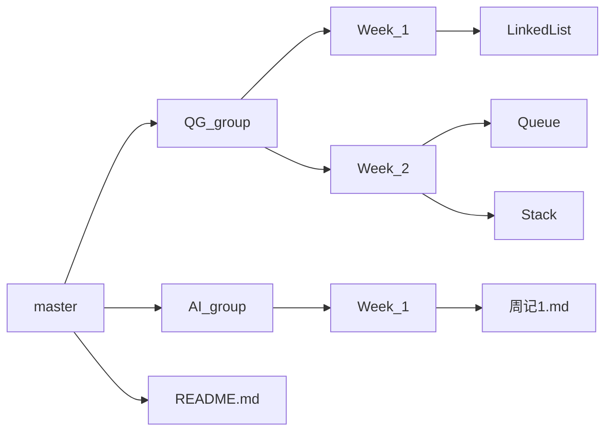

```mermaid
graph LR
master --> QG_group
master --> AI_group
master --> README.md
QG_group --> 1[Week_1]
QG_group --> Week_2
Week_2 --> Queue
Week_2 --> Stack
1[Week_1] --> LinkedList
AI_group --> 2[Week_1]
2[Week_1] --> 周记1.md
```

