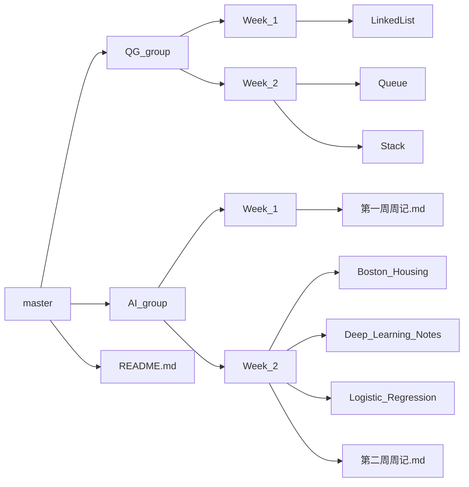

```mermaid
graph LR
master --> QG_group
master --> AI_group
master --> README.md
QG_group --> 1[Week_1]
QG_group --> 3[Week_2]
3[Week_2] --> Queue
3[Week_2] --> Stack
1[Week_1] --> LinkedList
AI_group --> 2[Week_1]
AI_group --> 4[Week_2]
4[Week_2] --> Boston_Housing
4[Week_2] --> Deep_Learning_Notes
4[Week_2] --> Logistic_Regression
4[Week_2] --> 第二周周记.md
2[Week_1] --> 第一周周记.md
```

